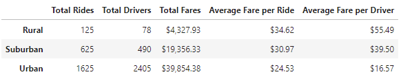
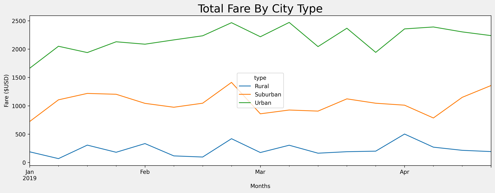

# Pyber Analysis

## Overview of the analysis

This analysis aims to create a summary dataframe that shows the ride sharing data based on city types, Rural, Urban, or Suburban.  After combining and formating the data, the pivot() and resample functions are used to create the multiple line graph to show the total fares for each week based on the city type between January 2019 and April 2019. 

## Results

The results are shown below. 

The results are visualized below.

- Urban cities have the most drivers, riders, and total fares. 
- Rural cities have the fewest drivers, riders, and total fares. 
- Urban cities have the lowest averages of fares per ride and fares per driver. 
- Rural cities have the highest averages of fares per ride and fares per driver. 

## Summary

Based on the analysis, we have concluded a pattern of fares and average fares of different city types. Due to the limitations of the data, we did not analyze the fares and average fares on individual cities. However, it is clear that the rural cities will be of higher fares as there are fewer workers coming to these cities. The travel time and distance is likely longer than if in urban cities, resulting in the averages of fares the highest among the three. 

My recommendations are the following. 

- Assign drivers to urban, suburban, and rural areas as equally as possible, so that it would be as fair for each driver. 
- Slightly increase the charges in urban cities, as the trip would usually be shorter. 
- Slightly lower the charges in rural cities, as the trip would usually be longer. 
